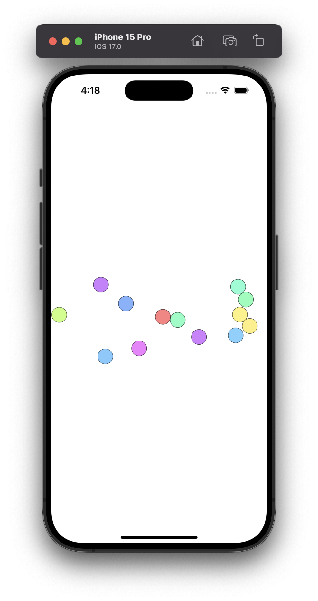
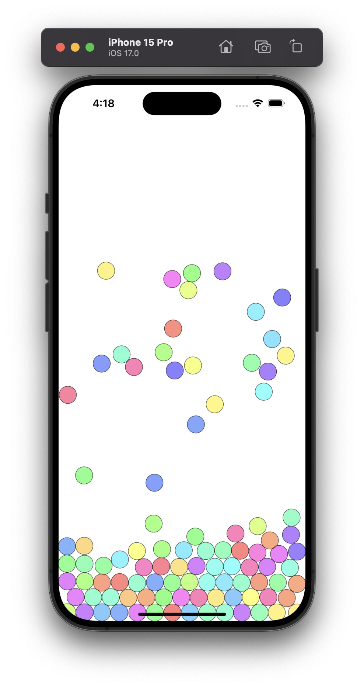
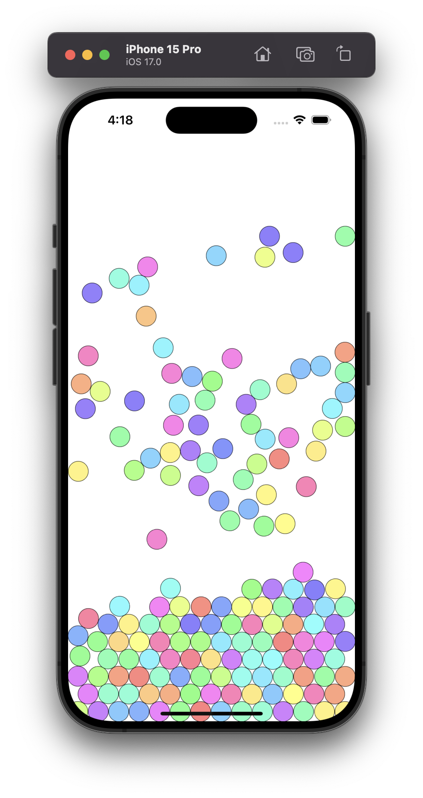
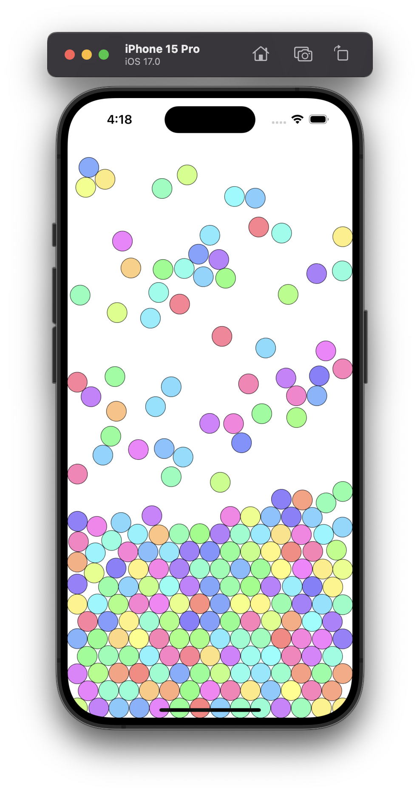
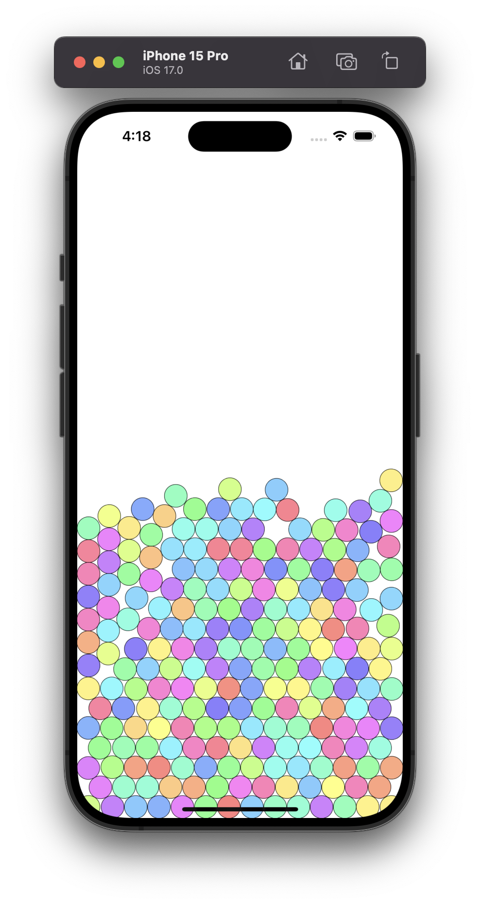
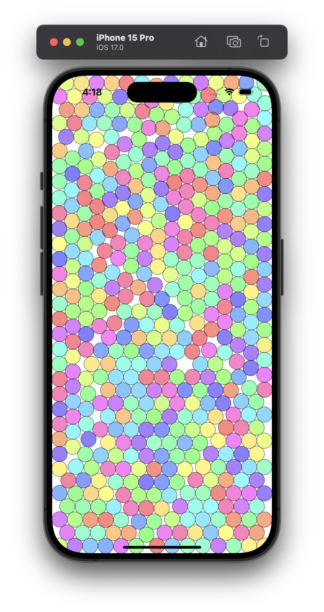

# GravityBubbles
Simple Swift application which allows users to tap the screen and create a random number of randomly generated and randomly coloured bubbles. The initialised method of the EllipseView class is overridden to customise the design of the bubble and the UIColor class is extended to randomly generate colours.

  
   

  
   

  
   

 
 
 